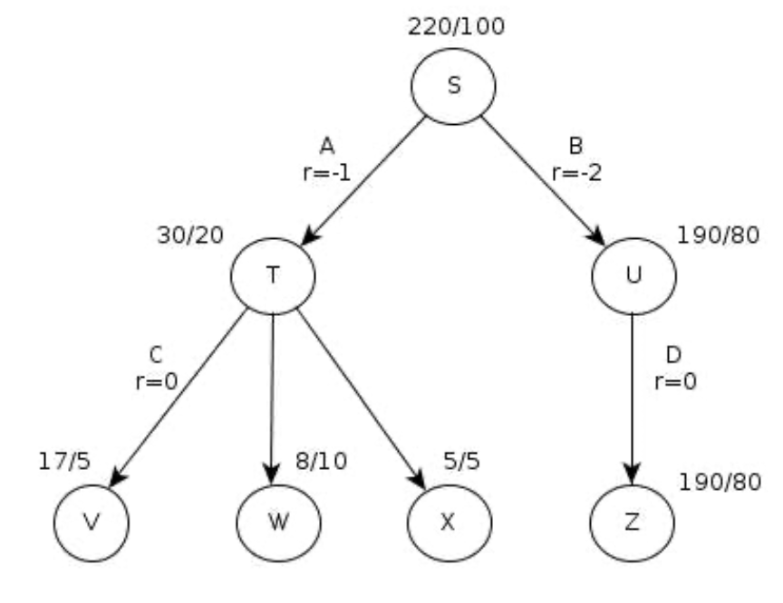

# 2018 Sample Exam Solution

## Question 4
Explain the concept of an *all-outcomes determinisation* in non-deterministic planning, and how it is used to solve non-deterministic planning problems.

## Answer 4

?

---

## Question 8

This is an exercise to help develop your intuition about why TD methods are often more efficient than Monte Carlo methods. Consider the following driving home scenario:
“ Suppose you have lots of experience driving home from work. Then you move to a new building and a new parking lot (but you still enter the highway at the same place). Now you are starting to learn predictions for the new building. ”

1. Would TD update be better on average than an Monte Carlo update on this scenario?
2. Give another example scenario — a description of past experience and a current state — where the best update (TD or MC) would be the opposite of the driving scenario. Can you see why TD updates are likely to be much better, at least initially, in some scenarios? Justify your answers.

## Answer 8

1. No. The main problem with TD learning is that their step updates are biased on the initial conditions of the learning parameters. The bootstrapping process typically updates a function or lookup Q(s,a) on successor value Q(s', a') using whatever the current estimates are int hte later. Clearly at the very start of learning these estimates contain no information from any real rewards or state transitions. Monte Carlo methods do not suffer form this bias, as each update is made using a true sample of what Q(s, a) should be.
2. Yes if the past experience and the current state content enough information for training. If learning works as intended, then the bias will reduce asympototically over multiple iterations. Monte Carlo methods need "swallow back up" for every step. It need more samples to achieve the same degree of learning compared to TD. It is often slower than TD.

---

## Question 9

Below is a tree from MCTS in which 100 roll-outs have been performed, and 7 nodes expanded. The notation X/Y indicates that Y number of roll-outs have been performed, with a cumulative score of X, and thus X/Y is the average score and value for that state.
Given this tree, what would action should be chosen at state S to maximise expected reward?

## Answer 9

Q(S, A) = -1 + 1.5 = 0.5

Q(S, U) = -2 + 2.375 = 0.375

max(Q(S, A), Q(S, U)) = Q(S, A)

So choose action A.