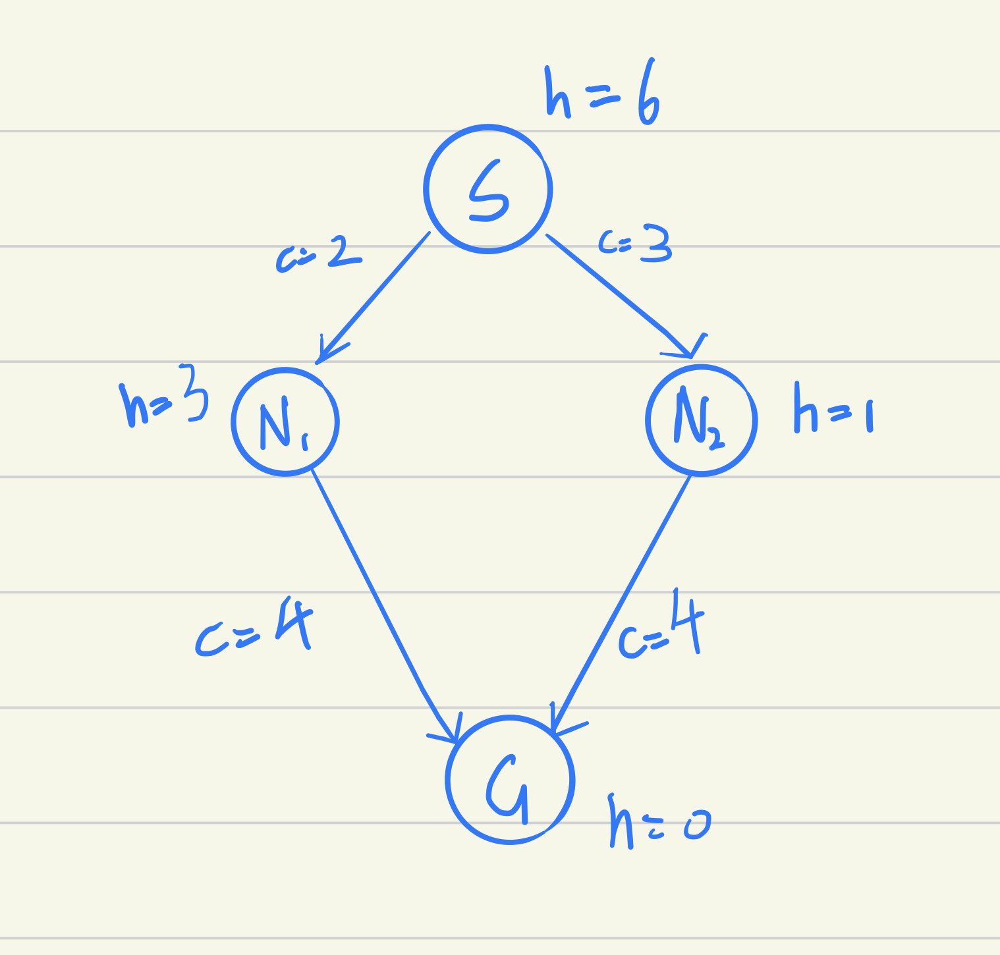
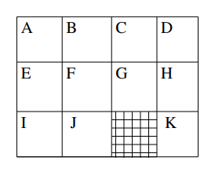
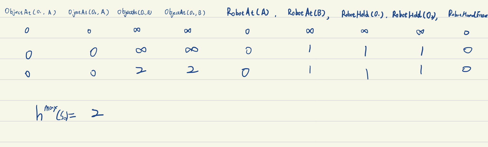
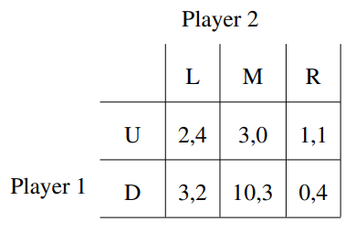
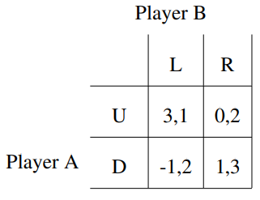

# Practice exam quiz (long answer questions) 2020

## Blind and heuristic search

### Question 1

The following search algorithms can be implemented in a similar manner, differing only in the abstract data structure used to implement the open list.

- Breadth First Search
- Depth First Search
- Uniform Cost Search

Answer the following questions:

1.  State which abstract data structure you would use for Breadth First Search. Briefly explain, in one or two sentences, why you would choose the particular data structure.
2. State which abstract data structure you would use for Depth First Search. Briefly explain, in one or two sentences, why you would choose the particular data structure.
3. State which abstract data structure you would use for Uniform Cost Search. Briefly explain,
   in one or two sentences, why you would choose the particular data structure.

### Answer 1

1. BFS: Queue. For BFS, we need a data structure that can support First-In-First-Out. 
2. DFS: Stack. For DFS, we need a data structure that can support Last-In-First-Out.
3. Uniform Cost Search: Priority queue. For Uniform Cost Search, we would exploit the node with the lowest cumulative action cost among the node set we can visit currently. The priority queue can help provide the node with the order we want.

---

### Question 2

Recall that A* requires a consistent heuristic to guarantee finding an optimal plan without reopening nodes. Draw or define a graph and make up an admissible but inconsistent heuristic function where A* returns a suboptimal solution.

Write down the steps involved in the A* algorithm by devising a simple example to illustrate.

Note: avoid making large examples, a graph with 4 nodes should be sufficient.

### Answer 2




**Admissible:**

h(S) < h\*(S) =  6; h(N1) < h\*(N1) = 4; h(N2) < h\*(N2) = 4

**Inconsistent:**

h(N1) + 2 = 5 < h(S)

**Step:**

f(N1) = g(N1) + h(N1) = 5

f(N2) = g(N2) + h(N2) = 4

f(N1) > f(N2)

So choose N2,

the path it generates is `S -> N2 -> G`

But the optimal path is `S -> N1 -> G`

---

## Case

The next five questions refer to the following example. They concern a classical planning problem where a robot can move horizontally and vertically to adjacent cells as depicted in the figure below. Note that the robot *cannot* move diagonally between cells and the *hashed* cell is inaccessible to the robot.



In answering the sub-questions below, you are allowed to use variables as arguments for the actions (action schemes), specifying the values of the variables. Note: it is **not** compulsory to use PDDL syntax, as long as you can convey the main ideas.

Hint: consider that the position of the robot could be modelled as either:

- row/column tuples, e.g. (0, 0) could refer to the lower left cell, or
- single cells, e.g. position (I) could refer to the lower left cell.

---

###Question 3

Describe briefly in STRIPS how to model the problem where a robot can move horizontally and vertically among adjacent cells, such that the $h^{add}$ heuristic estimates the same values as the Manhattan heuristic

### Answer 3

Suppose the start point is (0,0).

$P = <F, O, I, G>$

$F =\{at(x), at(y), visited(x, y) | x \in \{0, 1, 2\}, y \in \{0, 1, 2, 3\} \}$ 

O = {move(x, y, x', y') :

​    \- Prec: at(x), at(y)

​    \- Add: at(x'), at(y'), visited(x',y')

​    \- Del: at(x), at(y)

| |dx + dy| = 1 and (x', y') $\notin$ *hashed* cell}

I = {at(0), at(0), visited(0, 0)}

G = {visited(x, y) | (x, y) $\in$ V}

---

### Question 4

Describe briefly in STRIPS how to model the problem where a robot can move horizontally and vertically among adjacent cells, such that the  $h^{add}$ heuristic estimates the same values as the Optimal heuristic.

### Answer 4

---

STRIP:

$P = <F, O, I, G>$

$F =\{at(x, y), visited(x, y) | x \in \{0, 1, 2\}, y \in \{0, 1, 2, 3\} \}$ 

O = {move(x, y, x', y') :

​    \- Prec: at(x, y)

​    \- Add: at(x', y'), visited(x',y')

​    \- Del: at(x, y)

| for each adjacent(x,y)(x',y') and (x', y') $\notin$ *hashed* cell}

I = {at(0, 0), visited(0, 0)}

G = {visited(x, y) | (x, y) $\in$ V}

### Question 5

Using your last STRIPS encoding where *hadd = h∗*, an initial state *s0 = robot at location I* and a goal state *sg = robot at location K*, compute *hadd(sg)* and *hff* from the best supporters induced by *hadd*.

**Show your working**

### Answer 5

$h^{add} = 5$

bs(at(K)) = move(H, K) -> need at(H)

bs(at(H)) = move(G,H) -> need at (G)

bs(at(G)) = move(F, G) -> need at(F)

bs(at(F)) = move(E,F) -> need at(E)

bs(at(E)) = move(I,E). Support by initial state: at(I)

Relaxed Plan is {move(I,E),move(E,F),move(F, G) ,move(G,H),move(H, K) }

$h^{ff} = \sum_{a\in RPlan} = 5$

---

### Question 6

We have 2 rooms A and B, 2 objects o1 and o2. A robot can load and unload objects if the robot is at the same location, and move from one room to the other. We want to get o1 and o2 into room B, given that both are initially at A.

Model the problem in STRIPS in such a way that the optimal plan would be the following:

```
pick(o1, A), move(A, B), drop(o1, B), move(B, A), pick(o2, A), move(A, B), drop(o2, B) 
```

### Answer 6

---

STRIPS  = <F, O, I, G>
F = {
ObjectAt(obj, room), RobotAt(room), RobotHold(obj), RobotHandFree 
$| obj \in\{o1, o2\}\wedge room \in\{A,B\}$
}

O = { 
pick(obj, room): 
\- Prec: RobotAt(room), ObjectAt(obj, room), RobotHandFree 
\- Add: RobotHold(obj)
\- Delete: RobotHandFree, ObjectAt(obj, room)

move(room, room'):
\- Prec: RobotAt(room),
\- Add: RobotAt(room')
\- Delete: RobotAt(room)

drop(obj, room):
\- Prec: RobotAt(room), RobotHold(obj)
\- Add: RobotHandFree
\- Delete: RobotHold(obj)

$| room \in \{A, B\} \wedge obj \in \{o1, o2 \}$

}

I = {ObjectAt(o1, A), ObjectAt(o2, A), RobotHandFree}

G = {ObjectAt(o1, B), ObjectAt(o2, B)}

---

### Question 7

What’s the hmax(s0) value of your STRIPS model, where s0 stands for the initial state?

Show your working

### Answer 7



---

## MDPs and reinforcement learning

The next six questions refer to the following example

Imagine a kitchen robot whose task is to ask the user what kinds of cereals he/she wants for breakfast, wait for the user answer, and then hand out the appropriate cereal box once it knows the desired cereal. We want to design a simple dialogue system to handle the interaction with the user.

A simple way to model it is via a discount-reward MDP with only two states: UnknownCereal, where the robot does not know which cereal to give, and KnownCereal, where the robot knows the cereal to hand out.

There are only two possible actions in the model:

Action **AskCerealType** corresponds to the robot asking the user for the cereal box he/she wishes to have. The action is only available in state **UnknownCereal**, and has a reward of -1 (a cost) in that state.
The probability of **reaching state KnownCereal is 0.8** (if the user answers the robot’s question), and otherwise (probability 0.2) the robot remains in UnknownCereal (if the user ignores the question or provides an unclear answer).
Action GiveCereal corresponds to the robot physically giving the cereal to the user. The action is available in the state KnownCereal, and has a reward of 5.
When the robot executes this action in state KnownCereal, the MDP reaches an absorbing goal state and finishes. As such, there is no reward available from this state.
When the robot executes this action in the UnknownCereal state, the MDP reaches the absorbing goal state with probability 0.3 (it gets lucky and hands the right cereal) and receives a reward of 5, or the person rejects the cereal and the robot goes back to the UnknownCereal state with probability 0.7 and receives a reward of -2.

---

### Question 8

Assuming a discount factor γ = 0.9, calculate the the value function V for each of the states UnknownCereal and KnownCereal using value iteration, for the 2nd and 3rd iterations.

Show your working.

Iteration 1:
V(KnownCereal) = 0.0
V(UnknownCereal) = 0.0

### Answer 8

Iteration2:

Q(Unknown, Ask) = -1

Q(Unknown, Give) = 0.1

**V(Unknown) = 0.1**

**V(Known) = 5**

Iteration3:

Q(Unknown, Ask) = 2.618

Q(Unknown, Give) = 0.163

**V(Unknown) = 2.618**

**V(Known) = 5**

---

### Question 9

Given the value function that you calculate above, what policy would maximise the robot’s expected reward?

Show your working.

### Answer 9

In known state: GiveCereal

In unknown state: AskCerealType

---

### Question 10

In your own words, explain the difference between value iteration and policy iteration.

### Answer 10

Value iteration iterates over value functions, policy iteration iterates over policies themselves. 

Value iteration is simpler but its computationally heavy.

Policy iteration is complicated but its computationally cheap w.r.t value iteration.

The main difference is that the way they calculate the V(S') in the Bellman equations is different.

---

### Question 11

The robot designers have found that the probabilities used for outcomes are incorrect and different for each household. As such, they
decide to instead use reinforcement learning to learn the policy after deployment.

A few weeks after deployment, one such robot has the following Q-table:

| **State**       | **AskCereal** | **GiveSerial** |
| --------------- | ------------- | -------------- |
| *UnknownCereal* | 7.2           | 1.9            |
| *KnownCereal*   | --            | 3.4            |

Assuming a discount reward factor of 0.9 and a learning rate of 0.5.

In the state *UnknownCereal*, the robot executes *GiveCereal*, which is rejected. It decides to execute *GiveCereal* again.

Update the Q-table both the 1-step Q-learning and 1-step SARSA updates for the first *GiveCereal* action. That is, calculate two new Q-tables.

**Show your working.**

### Answer 11

Q-learning:

Q(U, G) = 1.9 + 0.5(-2 + 0.9 * 7.2 - 1.9) = **3.19**

| **State**       | **AskCereal** | **GiveSerial** |
| --------------- | ------------- | -------------- |
| *UnknownCereal* | 7.2           | 3.19           |
| *KnownCereal*   | --            | 3.4            |


SARSA:

Q(U, G) = 1.9 + 0.5 (-2, + 0.9 * 1.9 - 1.9) = **0.805**

| **State**       | **AskCereal** | **GiveSerial** |
| --------------- | ------------- | -------------- |
| *UnknownCereal* | 7.2           | 0.805          |
| *KnownCereal*   | --            | 3.4            |


---

### Question 12

Challenge Question: In the state UnknownCereal, the robot executes GiveCereal three times in a row. Each time the cereal is rejected.

Calculate the 2-step SARSA update for this execution of three actions

Assume the same parameters (discounter reward factor, etc) as in the previous question

Show your working

### Answer 12


$G^{2}_{t} = -2 + 0.9 * -2 + 0.81 * 1.9 = -2.261$

Q(U, G) = 1.9 + 0.5(-2.261 - 1.9) = -0.1805

---

### Question 13

The robot designers are finding that the owners of the robots are demanding a refund because the robots get their cereal preference wrong too often. Give one technique that the robot designers could do to improve the situation.

### Answer 13

In UnknownState, when the user first started to use the machine, we use pure strategy, which always do *AskCerealType* action and learn from it first. At the same time it train the user's preference in the background. When training reaches a certain level, then start to do action based on the new policy. Or we can ask the user to setup some preference first and use the data to do reware shaping. 

---

### Question 14

Imagine a reinforcement learning algorithm that monitors heart beat information from a fitness device, such as a FitBit, to determine whether a person develops a heart problem, such as an irregular heartbeat or a faster heartbeat.

List one potential ethical dilemma that could occur in such a situation. Justify why you believe this could be a serious problem.

### Answer 14

Privacy leak problem. The user may not want others to know his heart problem, but the data needs to be uploaded to the server for training. If the user information is leaked during the period, there may be serious consequences. Moveover, the tips of the watch may let people around the user discover his problem and this leak privacy in reality.

---

### Question 15

Consider the following abstract two-player game in normal form. Find all pure and mixed-strategy equilibria for this game.



HINT: Consider the notion of *dominated strategies*, in which some strategies are strictly dominated by others, so can be discarded.

**Show your working**

### Answer 15

No pure strategy.

Mixed strategy:


---

###Question 16

**Challenge Question**: Two players, A and B play the following game.

First A must choose IN or OUT.

If A chooses OUT the game ends, and the payoffs: are A gets 2, and B gets 0.

If A chooses IN then B observes this and must then choose IN or OUT.

If B chooses OUT the game ends, and the payoffs are: B gets 2, and A gets 0.

If B chooses IN then they play the following simultaneous move game:



Draw the extended-form tree for this game and calculate the equilibria of the extended-form game.

**Note:** to 'draw' the tree, you can use text format; e.g.

U -1.a-> X
X -2.b-> Y (0,1)
X -2.c-> Z (1,0)

represents a true with root node U. From U, player 1 must select move *a*, and the player 2 chooses between moves *b* and *c*

### Answer 16


---

### Question 17

**Challenge Question**. *The following question is under-specified, but is intended to improve your understanding of subject content and general problem-solving ability, rather than act as an entirely accurate* *reflection of an exam question.*

Consider a person who is mugged by someone on the street with a gun. The person has an unloaded gun in their own pocket. They could get the gun out to try to scare off the mugger, however, they risk the mugger shooting them instead. If they do not get out the unloaded gun, their mugger has time to search only their left or right pocket, but not both and the mugger will not shoot them. The person has \$100 in their left pocket and nothing in their right pocket, and the mugger knows this. Assume that if the mugger does not get the $100, they get no payoff.

Should the person draw their unloaded gun or not?

**Justify your answer**

### Answer 17

For me, the reward of dead is $-\infin$

Because P*($-\infin$) = $-\infin$

-100 > $-\infin$

I think the person should not draw his unloaded gun.

---

### Question 18

Below is a tree from MCTS in which a collection of roll-outs have been performed, and six nodes expanded are shown (others are omitted as they are not relevant to the question). The notation V(s) = v indicates that v is the value of state s, N = n indicates that the node has been visited n times, and r = R indicates that the reward R is given when this state is visited.


Using back-propagation, calculate the values for the states s and v.
Show your working

### Answer 18


### Question 19

Given your answer for the previous question, what would action should be chosen at state *s* to maximise expected reward?

**Show your working.**

### Answer 19

b, choose the action that have the max Q value.